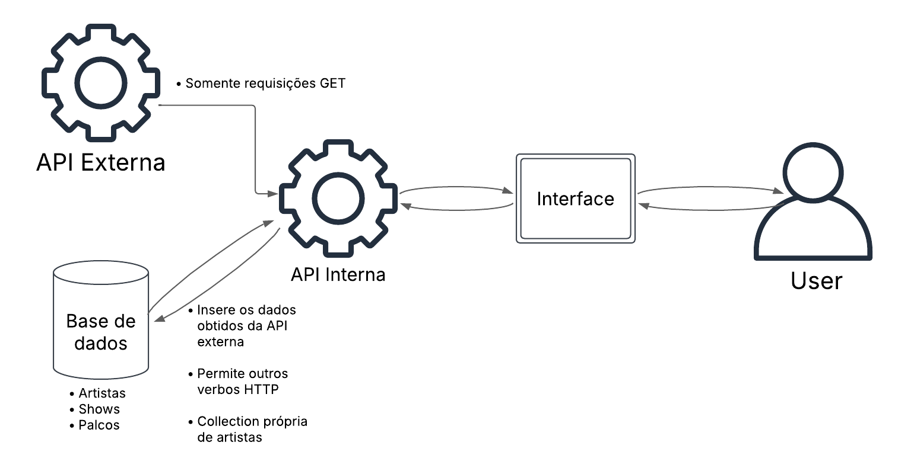

# **FASC 2077**

## **Introdução**

Este projeto busca simular uma demanda do FASC 2077 (Festival de Artes de São Cristóvão). Esta edição atípica busca simular a ocorrência do evento no ano de 2077 com diversas atrações que nunca foram cogitadas para o festival. A demanda se dá na criação de um site para exibir informações do evento.

## **Arquitetura**

